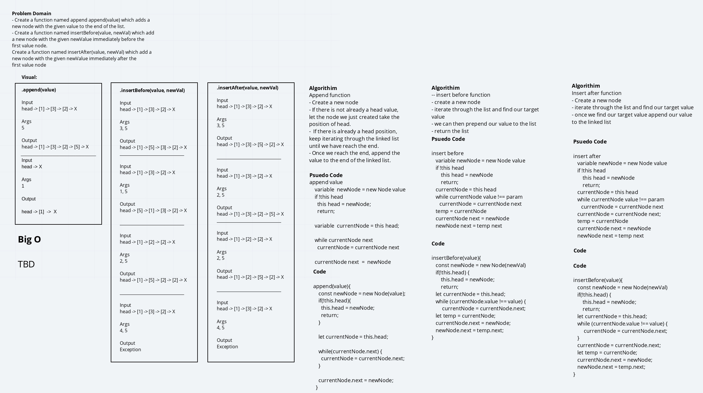

# Singly Linked List

## Challenge

Create a module that allows you to create linked lists and do three things: insert a new head into the linked list, check if something exists in a linked list with includes, and return a string of all the values that exist in the linked list with toString.

## Approach & efficiency & API

With insert I simply called the Node class constructor and assigned the head of the LinkedList class to be the new Node while assigning the next of the new node to the previous head.

With includes I define current node to the current head, loop through the list with a while loop while `currentNode.next` is truthy. In the while loop, have a conditional checking if `currentNode.value === value` where value is the argument. If true, return true. Otherwise, continue looping.

With toString, I declare a variable string and assign it an empty string. Then I go through a while loop the same way I did before for includes and used template literal to combine the string variable with the value of `currentNode`, doing it one last time outside the loop for the last node and return string.

I think everything is O(n)? Not sure on that front yet.

# Extended Singly Linked List

## Challenge

Extend your LinkedList class with methods `.append(value)` which will add a new node to the end of the list, `.insertBefore(value, newVal)` which will insert a node before an existing node with a value taken in as an arguement of the function call, and `.insertAfter(value, newVal)` which will insert a node after an existing node with a value taken in as an arguemtn of the function call.

## Approach & efficiency & API

With `.append()`, we check to see if a head node previously exists. If it does not, we just call `insert()` with value. If we don't, we traverse through the linked list with a while loop for as long as the nodes have a next. After finding the last node, we redefine the next property from `null` to `new Node(value)`.

With `.insertBefore(value, newVal)`, we check to see if a head node previously exists. If it does not, we just call `insert()` with newVal. If it does, we check to see if the head is the value we are looking for. If it is, we call `insert()` with newVal. If it does not, we traverse through the list with a while loop until we find the node with the next with the value that matches the value we're looking for. When we do, we reassign currentNode.next with new Node and feed in the currentNode.next as the next for the new node.

With `.insertAfter(value, newVal)`, we do something very similar to `.insertBefore()` but with some main differences: we check `currentNode.value` instead of `currentNode.next.value` for our while loop.

[code](./linked-list.js)

