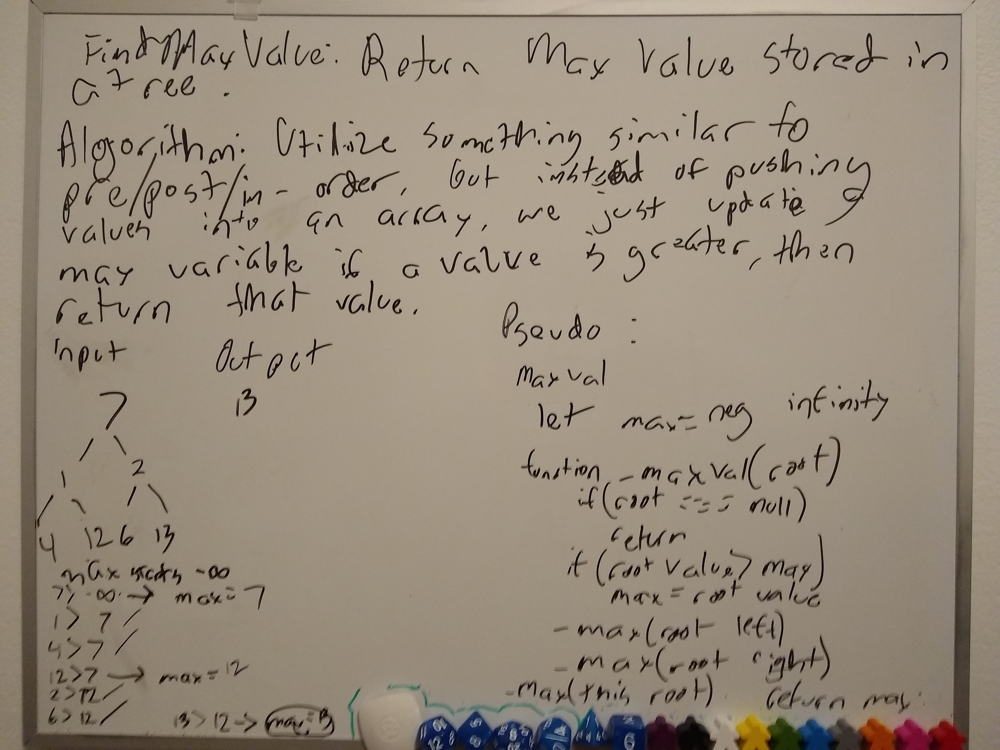

# Trees

## Find max value

We can find the max value of a plain-binary-tree (not search) by utilizing similar logic to pre/in/postOrder methods except instead of pushing into an array we return, instead we check vs a saved value and if the current value is greater than the saved value, update the saved value with the new max value. Then, we return the saved value.

