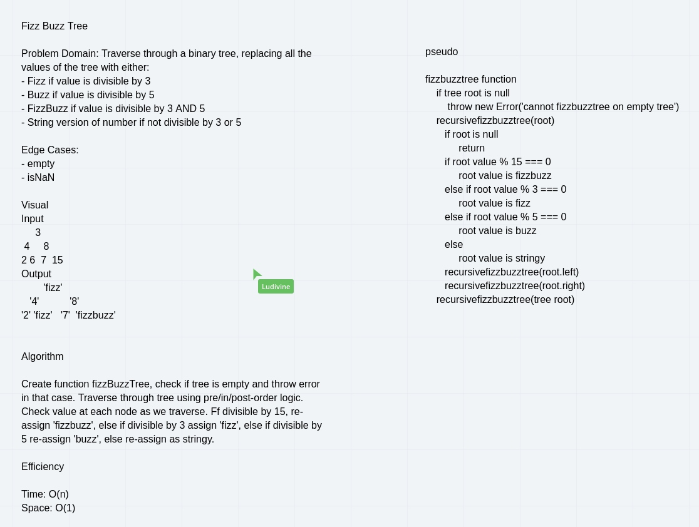

# Trees

## Find max value

[code](./tree.js)

We can find the max value of a plain-binary-tree (not search) by utilizing similar logic to pre/in/postOrder methods except instead of pushing into an array we return, instead we check vs a saved value and if the current value is greater than the saved value, update the saved value with the new max value. Then, we return the saved value.

## FizzBuzzTree

Mutate an existing tree using a fizzbuzz method, changing node values that are divisible by 3 to the string `Fizz`, divisible by 5 to `Buzz`, divisible by 3 and 5 to `FizzBuzz`, and converting things that are divisible by neither to a string version of their number (ie. `7` will resolve to `'7'`)

