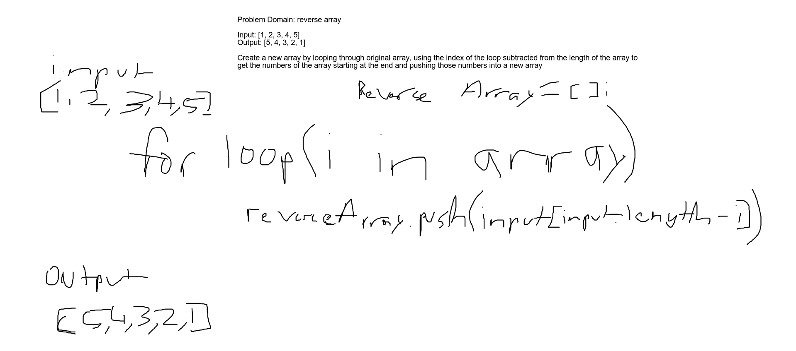

# Data Structures and Algorithms

## Language: `JavaScript`

### Reverse an array

## Challenge

Write a function that takes in an array and returns the same array with the values reversed

## Approach & Efficiency 

I created an empty array then iterated through the input array with a for loop and subtracted the index by the array.length to get the last item and pushed that last item into the empty array, then returned that empty array

## Solution

