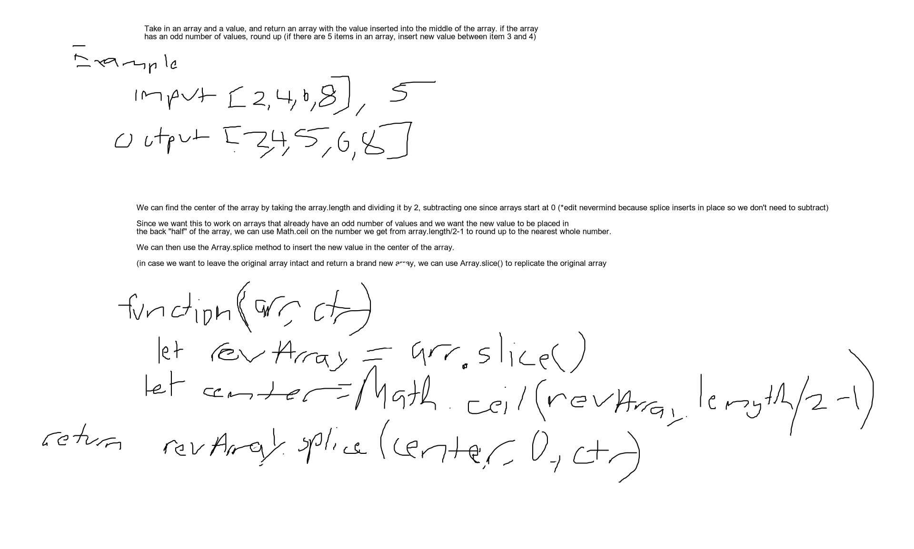
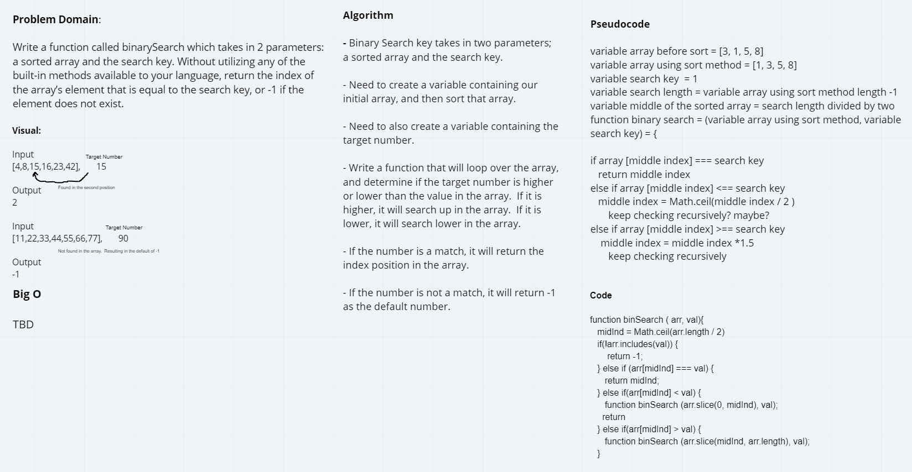

# Data Structures and Algorithms

## Language: `JavaScript`

### Reverse an array

#### Challenge

Write a function that takes in an array and returns the same array with the values reversed

#### Approach & Efficiency 

I created an empty array then iterated through the input array with a for loop and subtracted the index by the array.length to get the last item and pushed that last item into the empty array, then returned that empty array

### Solution

[code](./arrayReverse/array-reverse.js)

### Shift Array

#### Challenges

Write a function that takes in an array and a value and returns a new array with the value inserted into the center of the array.

#### Approach & Efficiency

I used the Array.slice() method to create a copy of the original array, then found the center index of the original array by dividing the length by 2 and then rounding up for arrays with an odd number of values. I then used the Array.splice() method to insert the value into the center of the array and then return the new array

### Solution

[code](./arrayShift/array-shift.js)

### Binary Search Array

### Challenge

Write a function that takes in an array and a value and returns the index that the value appears in that array and if it doesn't appear, return -1. Use a binary search algorithm to find the value.

#### Approach & efficiency

The first idea was to use recursion which although I did get it working in the end, it wound up being a bit more complicated and less straight-forward than I first thought and took a lot of experimenting and also looking at [this medium article](https://medium.com/jsunderthescope/a-recursive-binary-search-in-javascript-b29efaff64d6) about recursive functions. 

### Solution

The end result looks much different than what you see in the whiteboard because I had to change how the recursion worked.

[code](./arrayBinarySearch/array-binary-search.js)
