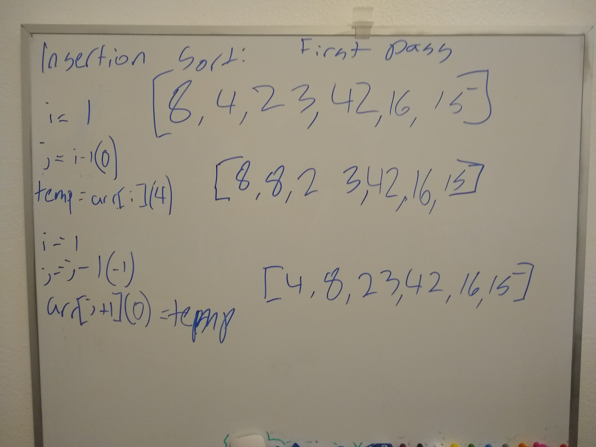
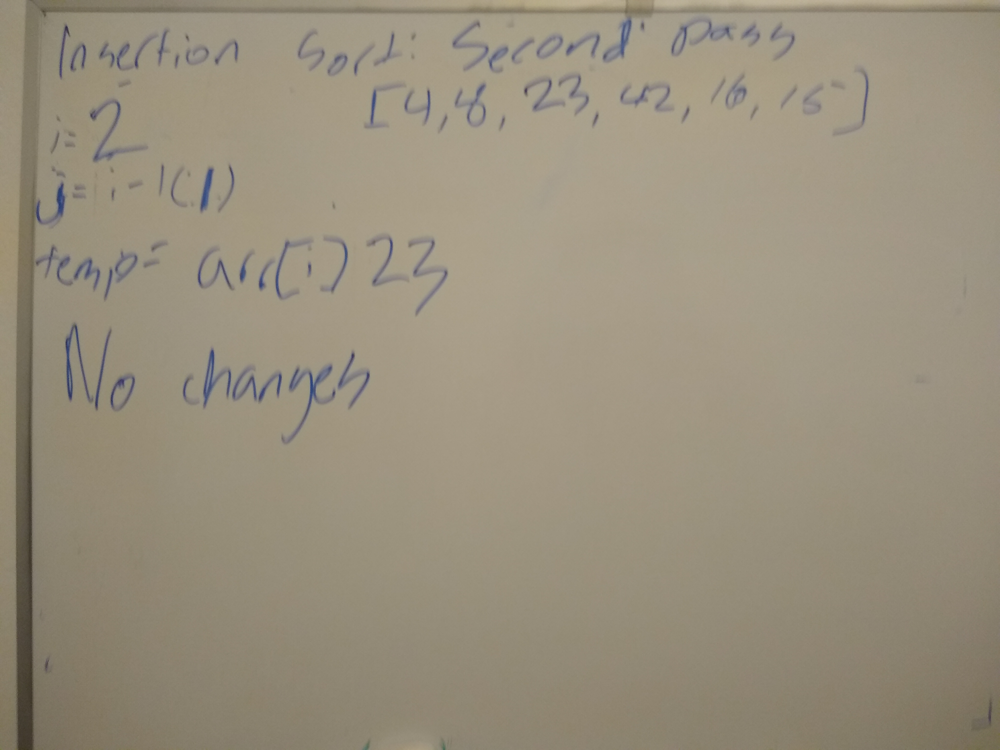
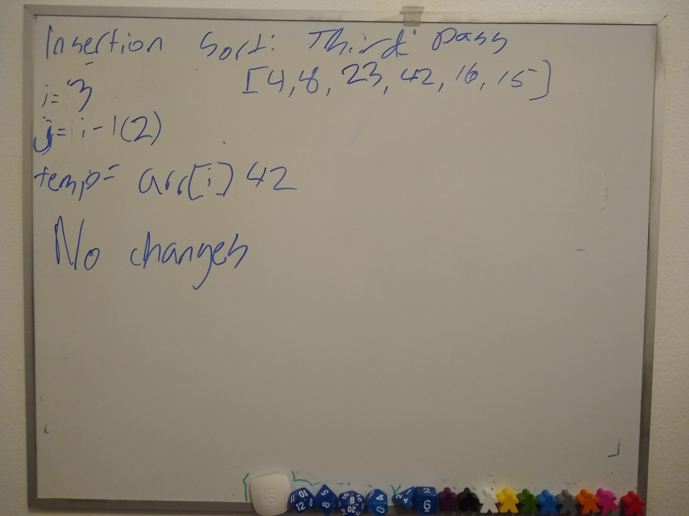
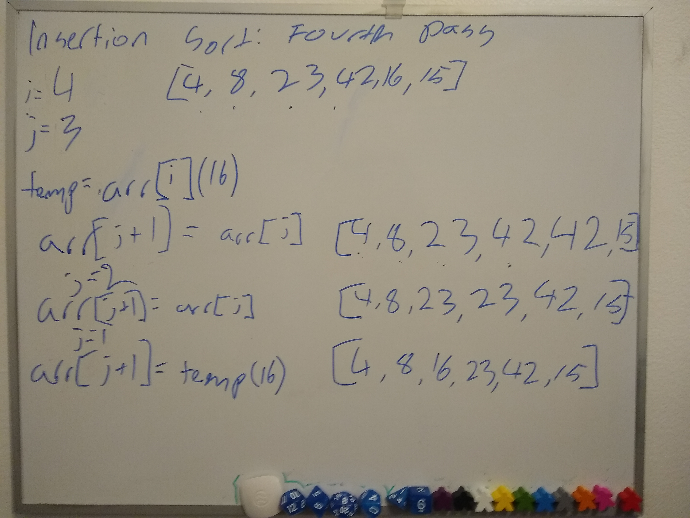
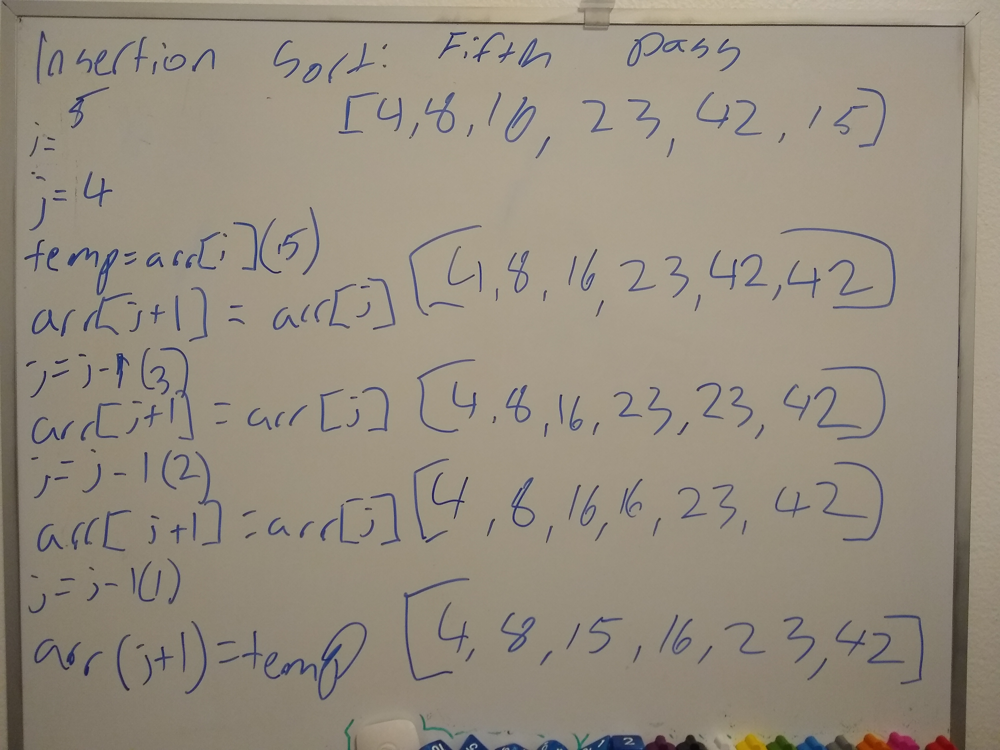

# Insertion Sort

Insertion sort is a sorting algorithm that moves through an array. For each value of the array, we save that number/value and then compare it to the number/value to the left. If the saved value is greater than the saved value, we do nothing and move right to the next value in the array. If the saved value is less than the next value to the left, we take that left value and put it one spot to the right. We continue doing that until we get all the way to the start of the array or the saved value is greater than the value to the left. In either case, we save the saved value to the current spot in the array and move right to the next value.

## PseudoCode

```
InsertionSort(int[] arr)
  
    FOR i = 1 to arr.length

      int j <-- i - 1
      int temp <-- arr[i]

      WHILE j >= 0 AND temp < arr[j]
        arr[j + 1] <-- arr[j]
        j <-- j - 1

      arr[j + 1] <-- temp
```

## Trace

Sample Array: `[8,4,23,42,16,15]`

### Pass 1:



Our `i` variable is predefined as 1 because of our for loop and our `j` variable is defined as `i-1` [0]. We assign a temp value with `arr[i]`, or 4. Then, because `j >= 0` AND `temp < arr[j]` (arr at j being 8), we enter our while loop and assign `arr[j + 1]` (index 1), and assign it the value at `arr[j]` (index 0). Then we decrement j. Now because j is less than 0, we exit the loop and define `arr[j+1]` (index 0) as our temp value, or the value formally at index 1. Now we start our for loop over.

### Pass 2



For our next pass, we have `i` as 2, `j` as `i-1` [1], and `temp` as `arr[i]`, or 23. Because temp is greater/not less than `arr[j]` (8), we never enter the while loop and we assign `arr[j+1]` (23) with `temp` (23), which is the same. Because we never entered our while loop and we never changed the definition of `j`, our array does not change on this pass.

### Pass 3



For the next pass, we have `i` as 3, `j` as `i-1` [2], and `temp` as `arr[i]`, or 42. Again, for this pass we never enter the while loop because temp is not less-than than what is left of temp (23), so our array does not change on this pass.

### Pass 4



For the next pass, we have `i` as 4, `j` as `i-1` [3], and `temp` as `arr[i]`, or 16. We do fulfill the condition for the while loop here, so we enter the while loop. We reassign 16 as 42 and decrement j(2). Then we still fulfill while loop condition so we reassign the left hand 42 as 23 and decrement j(1). We no longer fulfill the while loop because temp is not less than `arr[j]` (8), so we assign the left-hand 23 as 16.

### Pass 5



For the fifth(and last) pass, we have `i` as 5, `j` as `i-1` [4], and `temp` as `arr[i]`, or 15. We fulfill the condition for the while loop, so we start looping. We assign 15 as 42 and decrement j(3). Then we assign left-most 42 with 23 and decrement j(2). Then we assign left-most 23 with 16 and decrement j(1). Now we exit the while loop because `temp !< 8`, so we assign left-most 16 to 15. And we're done!

## Efficiency

- Time: O(n^2)
    - Worst case scenario because we have nested while loops
- Space: O(1)
    - We are simply modifying the original array so no additional space is being used.

[JavaScript Code](insertion-sort.js)

[Tests](../../../__tests__/test-insertion-sort.js)
