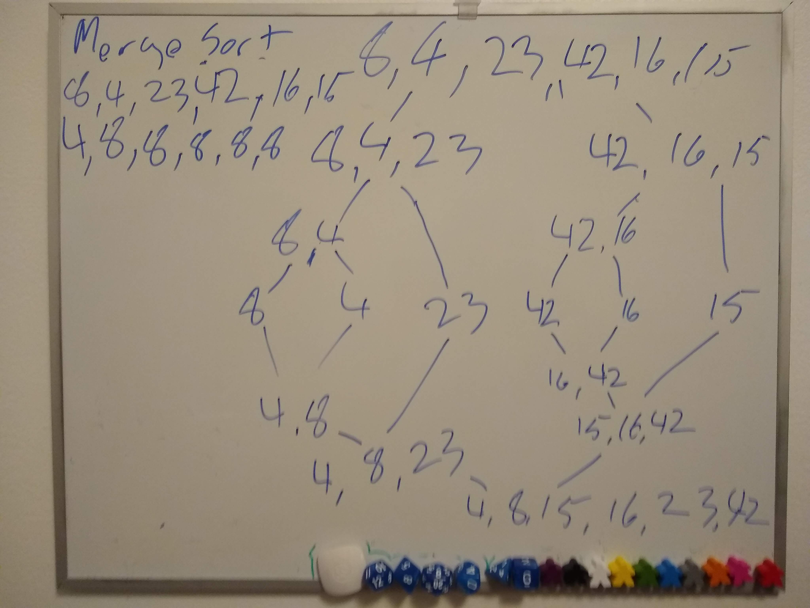

# Merge Sort

Merge sort is a method in which you go through an array of values and break them up until you have fragments of one, then merge the fragments together and sort them as you merge them together until all fragments are combined again into the full array. To do this in code, we utilize recursion, breaking up the array until we have fragments of one, then feeding broken down arrays into a child merge function which combine all the fragments together until last of all we combine the two halves of the array into one whole.

## PseudoCode

```
ALGORITHM Mergesort(arr)
    DECLARE n <-- arr.length
           
    if n > 1
      DECLARE mid <-- n/2
      DECLARE left <-- arr[0...mid]
      DECLARE right <-- arr[mid...n]
      // sort the left side
      Mergesort(left)
      // sort the right side
      Mergesort(right)
      // merge the sorted left and right sides together
      Merge(left, right, arr)

ALGORITHM Merge(left, right, arr)
    DECLARE i <-- 0
    DECLARE j <-- 0
    DECLARE k <-- 0

    while i < left.length && j < right.length
        if left[i] <= right[j]
            arr[k] <-- left[i]
            i <-- i + 1
        else
            arr[k] <-- right[j]
            j <-- j + 1
            
        k <-- k + 1

    if i = left.length
       set remaining entries in arr to remaining values in right
    else
       set remaining entries in arr to remaining values in left
```

## Trace

Sample Array: `[8, 4, 23, 42, 16, 15]`



This is an overview of how merge-sort operates when fed in an array. First, the outer function breaks it into `[8,4,23]` and `[42,16,15]`, then breaks the left half into `[8, 4]` and `[23]`, then `[8]` and `[4]`, then merge and sort them into `[4, 8]`, then sort those 3 into `[4, 8, 23]`. Then go into right half and break it into `[42, 16]` and `[15]`, then into `[42]` and `[16]`, then merge and sort into `[16, 42]`, then merge and sort into `[15, 16, 42]`, then finally merge and sort `[4, 8, 23]` and `[15, 16, 42]` into `[8, 4, 23, 42, 16, 15]`.

[JavaScript Code](merge-sort.js)

[Tests](../../__tests__/test-merge-sort.js)